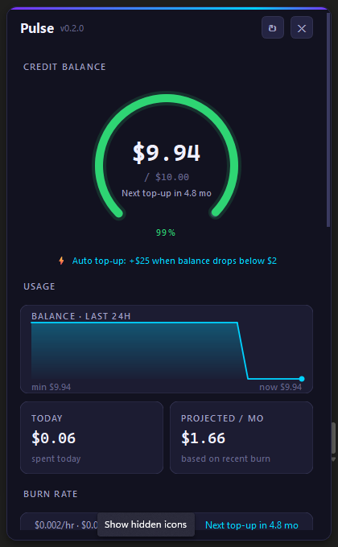
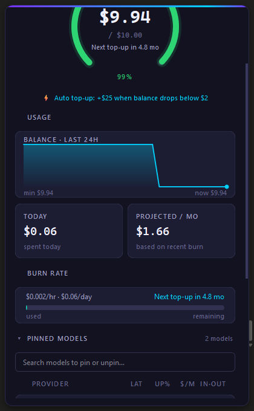
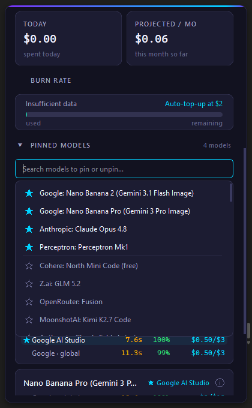
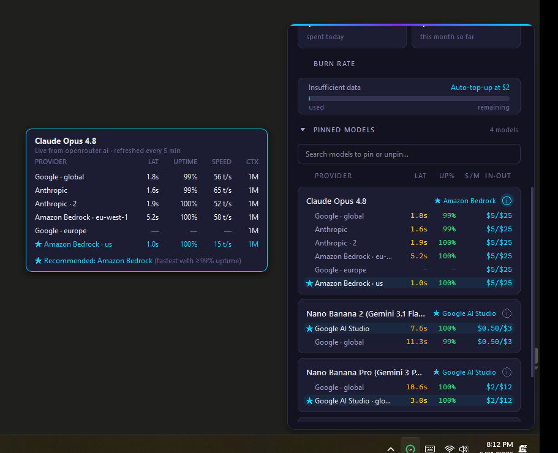
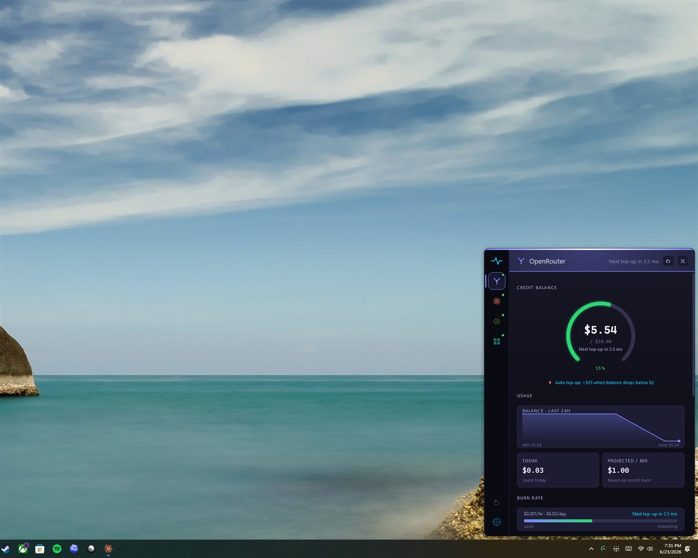

# Pulse

A Windows tray app for monitoring your OpenRouter subscription. Live balance, auto top-up aware forecast, 24h balance timeline, pinned models with per-provider health, and threshold notifications. Dark themed, frameless, stays out of your way.

More providers and aggregators planned. See [ROADMAP.md](ROADMAP.md).











## What it does

- Live balance shown as a circular gauge in the tray icon and a full panel on click.
- Auto top-up aware forecast: tells you when your next top-up will trigger based on your actual burn rate.
- 24 hour balance timeline with top-up jumps marked.
- Today's spend and a 30 day projection.
- Hourly and daily burn rate computed from your own history, persisted across restarts.
- Toast notifications when balance crosses your warning or critical threshold.
- **Pinned models with per-provider health.** Pick the models you actually use, see live p50 latency, 30-min uptime, and price for every provider serving each one. Best provider per model is highlighted. Refreshes every 5 minutes.
- **Dynamic model picker.** Click the search bar in the Pinned Models section to browse every model in OpenRouter's catalog. Click a star to pin or unpin. Changes save immediately. Type to filter.
- **Click-to-toggle info popup.** Each pinned model has an (i) icon that opens a detailed table of every provider (latency, uptime, throughput, context length). Anchored to the side of the dashboard so it doesn't cover the cards.
- **Collapsible sections.** Click the chevron in the Pinned Models header to fold the whole section away for a compact view.
- Right-click menu for quick links to OpenRouter's dashboard, credits page, and models page.
- Single instance lock so double-launching is a no-op.

## Install

### Option A: pre-built .exe (no Python needed)

Grab `Pulse.exe` from the [latest release](https://github.com/k4rg1l/pulse/releases/latest), double-click. That's it. First launch puts the tray icon in the hidden-icons area; drag it to the visible tray so it's always there.

Configure your API key once: right-click the tray icon → **Open Settings File...** Add your key in the `api_key` field. Restart Pulse.

The .exe is a self-contained PyInstaller bundle (~50 MB). Some antivirus flags PyInstaller binaries as suspicious on first run. That's a known false positive, you can verify the build is from this repo via the release page.

### Option B: from source (Python 3.10+)

```powershell
git clone https://github.com/k4rg1l/pulse.git
cd pulse
pip install -r requirements.txt
$env:OPENROUTER_API_KEY = "sk-or-v1-..."
python main.py
```

Tray icon appears in the bottom right. Left click opens the dashboard, right click opens the menu.

If you'd rather not use the env var, run the app once to generate `%APPDATA%\Pulse\settings.json`, then put your key in the `api_key` field there. The tray menu has an "Open Settings File..." entry that opens it in your default editor.

### Option C: build your own .exe

```powershell
pip install pyinstaller
python -m PyInstaller pulse.spec --clean --noconfirm
# Output: dist\Pulse.exe
```

## Run on startup

Right-click the tray icon and tick "Start with Windows". This adds a registry entry under `HKCU\Software\Microsoft\Windows\CurrentVersion\Run` that points at your current Python and main.py.

## Configure

All settings live in `%APPDATA%\Pulse\settings.json`:

```json
{
  "api_key": "sk-or-v1-...",
  "management_api_key": "",
  "auto_topup_threshold": 2,
  "auto_topup_amount": 25,
  "balance_warning": 5,
  "balance_critical": 1,
  "key_refresh_seconds": 60,
  "dismiss_on_focus_loss": true,
  "tracked_models": [
    "anthropic/claude-sonnet-4.5",
    "openai/gpt-5",
    "deepseek/deepseek-chat-v3.1",
    "google/gemini-2.5-flash"
  ]
}
```

`tracked_models` is the list of OpenRouter model IDs shown in the Pinned Models section. You can also pin or unpin from the search bar inside the section, which updates this file automatically.

Set `auto_topup_threshold` and `auto_topup_amount` to whatever you've configured on openrouter.ai. With them set, the forecast switches from "depletes in N days" to "next top-up in N hours" and the gauge shows an indicator.

`management_api_key` is reserved for a planned per-model spend feature (needs an OpenRouter management key). Leave it empty for now.

## Tech

PySide6, Python 3.10+, requests. About 2k lines across 8 files. Pure Qt, no web view, no Electron.

## Contributing

Issues and PRs welcome. If you want to take a roadmap item, open an issue first so we don't duplicate work.

**Agents/contributors: start at [HANDOFF.md](HANDOFF.md)** (current state + next steps), then **[AGENTS.md](AGENTS.md) before touching tray, focus, window, or popup code.** It lists the invariants, the validation checklist, and the API gotchas. Several of those entries exist because they bit us during development; honoring them saves you from re-discovering the same bugs.

**Testing:** [docs/TESTING.md](docs/TESTING.md) is the full guide — `pytest` for pure logic (`pip install -r requirements-dev.txt && python -m pytest -q`) and Windows-MCP recipes for validating the live UI. Read it before validating, and add to it when you ship a feature.

## License

MIT. See [LICENSE](LICENSE).
