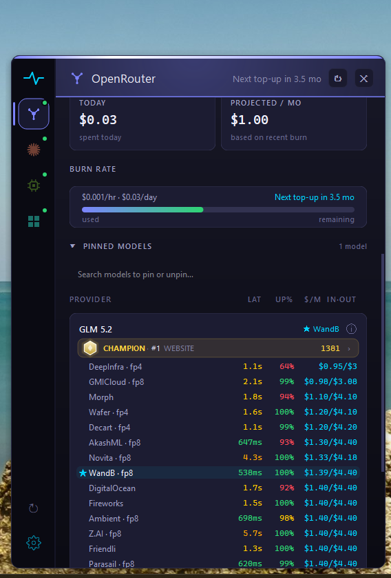
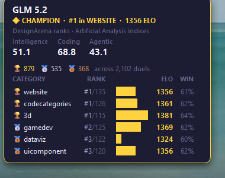
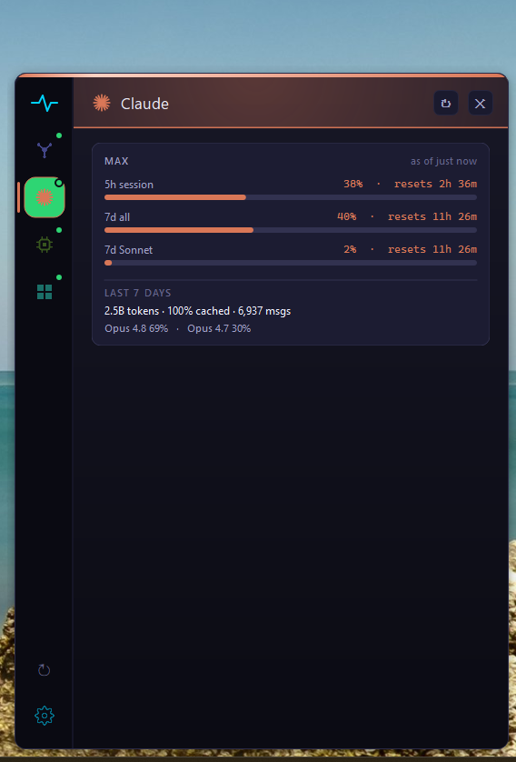
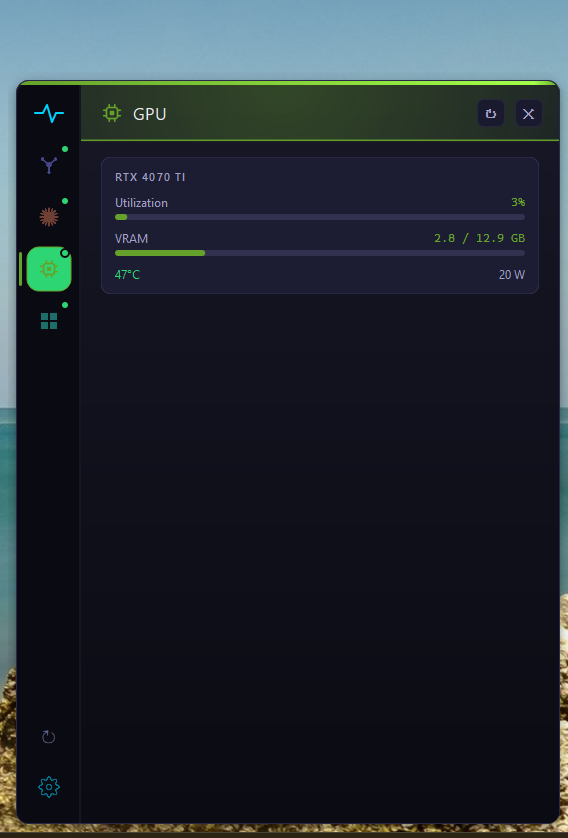
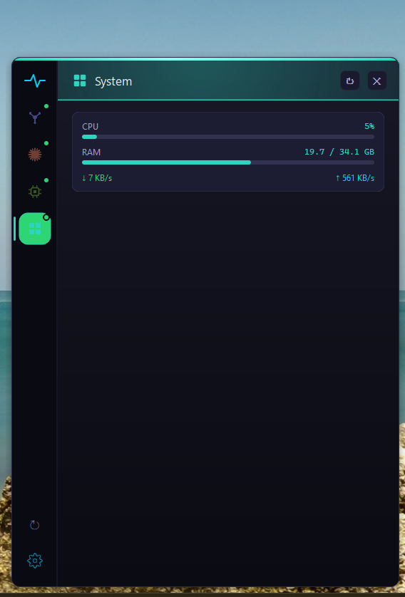
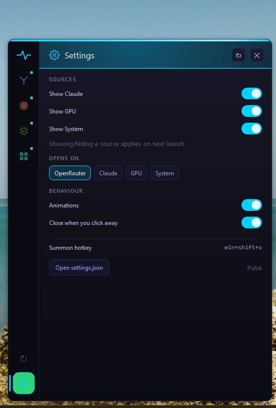

# Pulse

A lightweight Windows tray monitor for the things a developer watches all day — AI spend, usage limits, and machine vitals — in one frameless, dark, keyboard-summonable panel.

Pulse is **source-agnostic**: OpenRouter, Claude, GPU, and System are equal peers on a left nav-rail command center. Each has its own themed panel; no provider is privileged. Adding a new source follows a single contract.


## Sources

### OpenRouter
Live credit balance as a circular gauge, an auto-top-up-aware burn-rate forecast, a 24-hour balance timeline, today's spend and a 30-day projection — all computed from your own history and persisted across restarts. Pin the models you use to get a **per-provider health board**: live p50 latency, uptime, throughput, and price for every provider serving each model, with the best one highlighted.

**The Arena.** Each pinned model wears a competitive **rank crest** derived from its DesignArena ELO — Bronze through Champion — showing its best category and the global rank Pulse computes across the field. Click a crest for the **Fighter Card**: Artificial Analysis intelligence / coding / agentic indices, a lifetime tournament medal haul, and the full category ladder with ELO bars.





### Claude
5-hour, 7-day, and Sonnet usage limits with reset countdowns, plus 7-day local token accounting (total tokens, cache efficiency, message count, per-model split) parsed from Claude Code's session logs. Read-only — Pulse never refreshes or rotates the Claude token.



### GPU & System
NVIDIA utilization, VRAM, temperature, and power via NVML; CPU, RAM, and network throughput via `psutil`. Both auto-detect and hide gracefully when unavailable.




## Highlights

- **Nav-rail command center** — switch sources with one click; each panel carries its own accent identity and live status dots.
- **Global hotkey** — `Win+Shift+O` (configurable) summons the panel from anywhere.
- **Settings tab** — toggle sources, pick the default panel, set behavior; power users can still edit the JSON directly.
- **Structured logging** — JSON-lines to `%APPDATA%\Pulse\logs\` for easy debugging.
- **Stays out of the way** — frameless, never steals focus, no taskbar entry, single-instance, dismiss-on-click-away.



## Install

### Pre-built `.exe` (no Python required)

Download `Pulse.exe` from the [latest release](https://github.com/k4rg1l/pulse/releases/latest) and run it. The first launch places the tray icon in the hidden-icons overflow — drag it to the visible tray.

Set your API key once: right-click the tray icon → **Open Settings File…**, fill in `api_key`, and restart.

The binary is a self-contained PyInstaller bundle (~50 MB). Some antivirus engines flag unsigned PyInstaller builds as a false positive on first run; you can verify the build against this repository via the release page.

### From source (Python 3.10+)

```powershell
git clone https://github.com/k4rg1l/pulse.git
cd pulse
pip install -r requirements.txt
$env:OPENROUTER_API_KEY = "sk-or-v1-..."
python main.py
```

Left-click the tray icon to open the panel; right-click for the menu. To run on login, right-click the tray icon and enable **Start with Windows**.

### Build your own `.exe`

```powershell
pip install pyinstaller
python -m PyInstaller pulse.spec --clean --noconfirm   # -> dist\Pulse.exe
```

## Configure

Settings live in `%APPDATA%\Pulse\settings.json` (created on first run; also editable via the Settings tab):

```json
{
  "api_key": "sk-or-v1-...",
  "management_api_key": "",
  "tracked_models": ["anthropic/claude-opus-4.8", "z-ai/glm-5.2"],
  "auto_topup_threshold": 2,
  "auto_topup_amount": 25,
  "balance_warning": 5,
  "balance_critical": 1,
  "key_refresh_seconds": 60,
  "hotkey": "win+shift+o",
  "default_source": "openrouter",
  "show_claude": true,
  "show_gpu": true,
  "show_system": true,
  "show_arena": true
}
```

- `tracked_models` — OpenRouter model IDs shown in the pinned health board. Pin and unpin live from the search bar; the file updates automatically.
- `auto_topup_threshold` / `auto_topup_amount` — match what you've configured on OpenRouter; the forecast then reads "next top-up in N hours" and the gauge shows an indicator.
- `management_api_key` — an org-scoped OpenRouter management key, reserved for per-model spend analytics. Optional.

## Tech

Pure PySide6 (Qt) — no web view, no Electron. `requests` for HTTP, `nvidia-ml-py` and `psutil` for vitals (both optional). Python 3.10+.

## Documentation

- **[ROADMAP.md](ROADMAP.md)** — shipped features and what's next.
- **[AGENTS.md](AGENTS.md)** — contributor guide: architecture, the Qt/Win32 invariants, the source contract, and the validation checklist. Read it before touching tray, focus, window, or popup code.
- **[docs/TESTING.md](docs/TESTING.md)** — how to validate: `pytest` for pure logic, UI recipes for the live app.

## Contributing

Issues and pull requests are welcome. If you'd like to take a roadmap item, open an issue first so work isn't duplicated.

## License

MIT — see [LICENSE](LICENSE).
